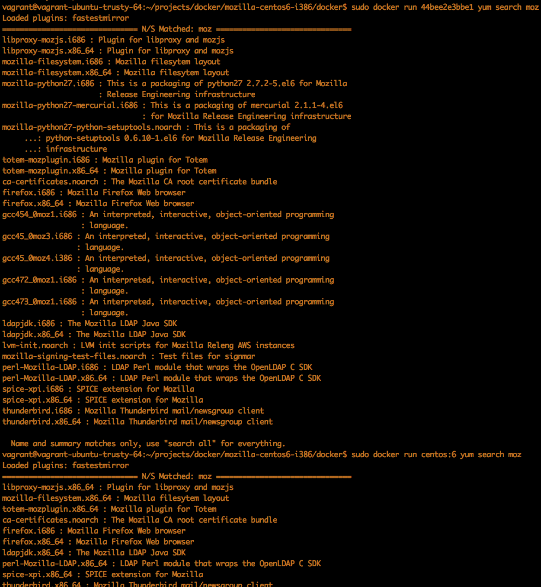

Mozilla RelEng Linux Build Environments
=======================================

Mock configs and Dockerfiles for generating build environments, with packages installed from Mozilla's RelEng repositories.

For pre-baked docker containers see:

##Linux 64

https://registry.hub.docker.com/u/mrrrgn/mozilla-centos6-x86_64/

##Linux 64 + Android (Mozilla Java Packages)

https://registry.hub.docker.com/u/mrrrgn/mozilla-centos6-x86_64-android/

These containers may be useful for Firefox Developers, trying to debug issues which appear on our in house CI servers. For instance, you can be sure that you're using the same libraries and compilers:
</img>
